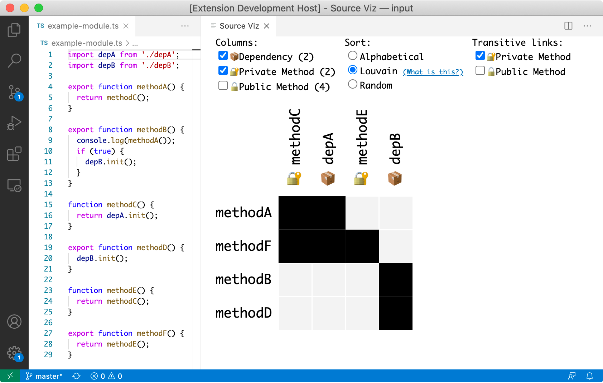

**Source Viz** is a VSCode extension for visualizing the relationship between a module's public API and its implementation details.  

You can use it to
* Make changes with confidence
  * Quickly get a sense of what a module does (i.e. what are its exported functions) and how (i.e. using which helper functions \ imports).
* Find refactoring opportunities
  * Identify how to split-up a large file (e.g. if a single public method uses a completely different code path than the rest of the public methods).

## Functionality

Press Cmd\Ctrl+Shift+P and select "**Open Source Viz**" to see the diagram of the file you are currently editing.

## Interpreting the results

The results are displayed in an [Adjacency Matrix](https://en.wikipedia.org/wiki/Adjacency_matrix).

* The **rows** represent the module's public API.  
  These would be its exported functions.
* The **columns** represent the module's internal implementation  
  These would be:
  * 🔐 Non-exported (private) functions
  * 📦 Imported members (dependencies)
  
Notice that in order to provide an accurate representation of the structure of real-world complex code, Source Viz follows functions as transitive links. For example, even though `depA` is not used directly in the source of `methodA`, it is marked as used by it because `methodA` uses `methodC` and `methodC` does use `depA`.  
You can turn off this default behavior by unchecking "Private Method" as "Transitive links" in the controls.

